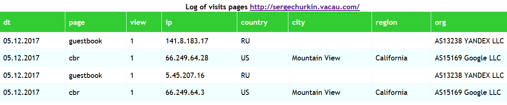

# log
Saving and forming the Log of visits WEB site pages based on AJAX requests.Saving (php and js).



## Description

The application savinglog information in `mySQL` table:

```
CREATE TABLE `count_log` (
  `id` int(12) NOT NULL AUTO_INCREMENT,
  `dt` date DEFAULT NULL,
  `ip` varchar(50) DEFAULT NULL,
  `page` varchar(50) DEFAULT NULL,
  `view` int(12) DEFAULT NULL,
  PRIMARY KEY (id)
) ENGINE=InnoDB AUTO_INCREMENT=1 CHARACTER SET 'utf8' COLLATE 'utf8_general_ci';
CREATE INDEX count_log_dt ON count_log(dt);
```
Put in `src/` file `params.php`:
```
<?php

return [
    'token' => 'eb3d3eqgerhjyktyhk2ab4a7acktyktuykrthetb', 
    'dbname' => 'yii2basic',
    'username' => 'root',
    'password' => 'pass',
    'host' => 'localhost'
];
```
To save data, you need to count_log.php send a GET request with the parameters:
`token`, `page` (name of the page), `ip` (`REMOTE_ADDR`).

To get Log table you need to count_log.php send a GET request with the parameters:
`page=count_log`, `days` (for how many days from the current).


[Run application.]( http://sergechurkin.vacau.com/count_log.html)
